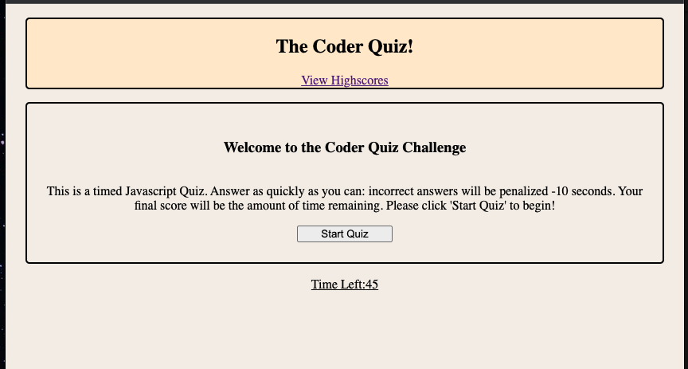
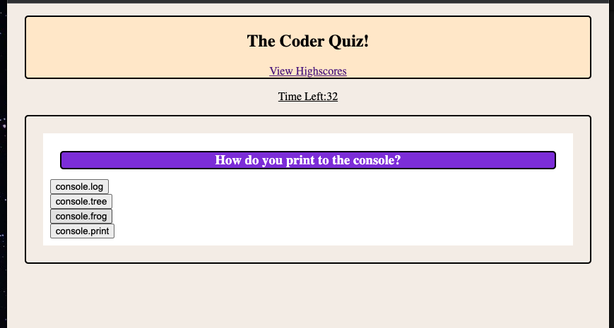
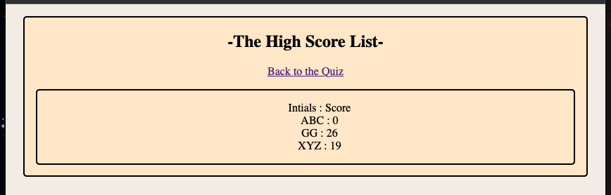

# Code_Quiz_4.2

## Title: The Coder Quiz
 

## Description:
This is a timed Javascript Quiz. Answer as quickly as you can: incorrect answers will be penalized -10 seconds. Your final score will be the amount of time remaining. Scores will be saved to browser local storage, and displayed by clicking 'View Highscores' on the main page.
  

## Links:  
repo: https://github.com/xnd0/Code_Quiz_4.2
 
live: https://xnd0.github.io/Code_Quiz_4.2/
  

## Screenshots:

 

## Technologies Used:
Javascript, CSS, and HTML